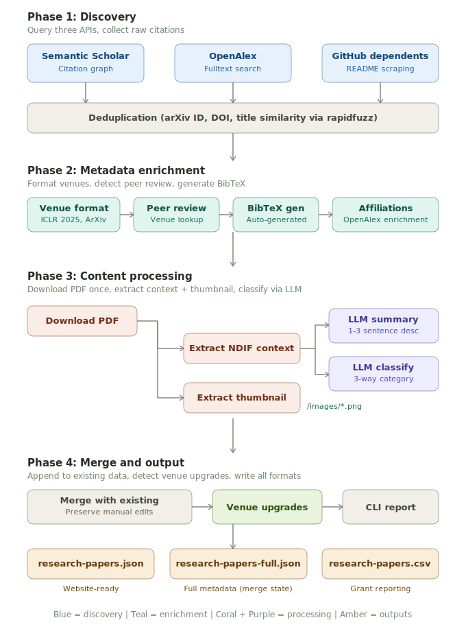
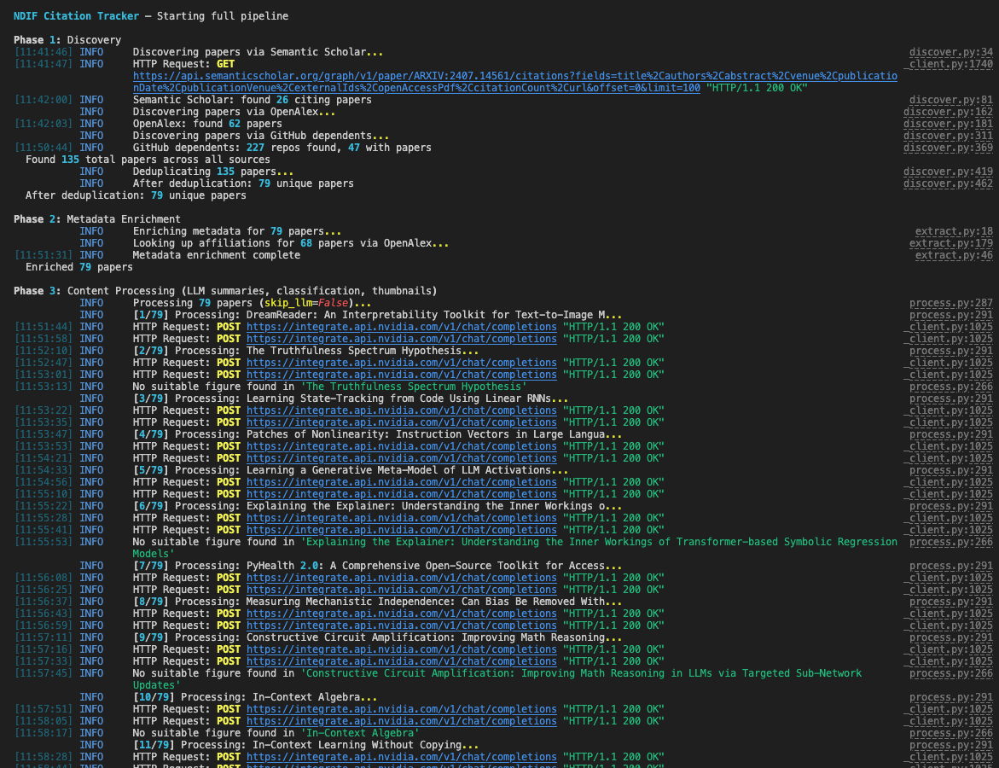
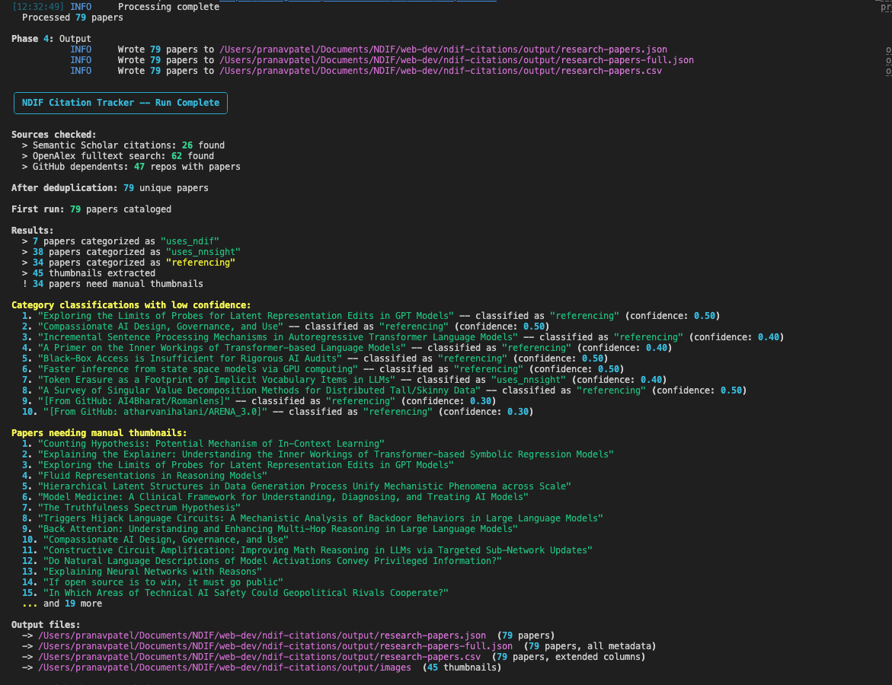

# NDIF Citation Tracker

Automated pipeline to discover, extract metadata for, and catalog all papers citing or using [NDIF](https://ndif.us) (National Deep Inference Fabric) and [NNsight](https://nnsight.net/).

Replaces a manual workflow of checking Google Scholar, copying metadata into spreadsheets, screenshotting figures, and updating website HTML — with a single command.

<p align="center">
  
</p>

## Quick start

```bash
# Install
pip install -e .

# Configure API keys
cp .env.example .env
# Edit .env with your keys

# Discovery only (no LLM keys needed)
python -m ndif_citations discover

# Full pipeline
python -m ndif_citations run
```

## Commands

| Command | Description |
|---------|-------------|
| `python -m ndif_citations run` | Full pipeline: discover, enrich, process, output |
| `python -m ndif_citations run --fresh` | Full pipeline, ignoring existing output |
| `python -m ndif_citations discover` | Discovery only — list papers, no LLM calls |
| `python -m ndif_citations add <url>` | Process a single paper by URL and append to output |

All commands accept `--output-dir <path>` and `--verbose` flags.

## Output

Each run merges into existing output and reports what changed:

```
★ 5 NEW papers added
✓ 47 already in database
✓ 2 papers updated (venue upgraded)
```

Use `--fresh` to rebuild from scratch.

```
output/
├── research-papers.json       # Website-ready (matches ResearchPaper TS interface)
├── research-papers-full.json  # Full metadata — persistent state between runs
├── research-papers.csv        # Extended columns for spreadsheet / grant reporting
├── images/                    # Extracted paper thumbnails
└── raw/                       # Raw API responses for debugging
```

## Project structure

```
ndif-citations/
├── pyproject.toml
├── .env.example
├── data/known_venues.json
├── docs/
└── src/ndif_citations/
    ├── cli.py        # Click CLI (run, discover, add)
    ├── config.py     # Constants, seed IDs, keywords
    ├── models.py     # Pydantic models (3-way category)
    ├── discover.py   # Phase 1: S2 + OpenAlex + GitHub
    ├── extract.py    # Phase 2: venue, peer review, affiliations
    ├── process.py    # Phase 3: LLM + thumbnails
    ├── output.py     # Phase 4: merge, JSON/CSV, CLI report
    └── utils.py      # PDF download, slugify, dedup, BibTeX
```

## Environment variables

| Variable | Required | Description |
|----------|----------|-------------|
| `S2_API_KEY` | No | Semantic Scholar API key (higher rate limits) |
| `LLM_BASE_URL` | For `run` | OpenAI-compatible LLM endpoint |
| `LLM_API_KEY` | For `run` | API key for the LLM provider |
| `LLM_MODEL` | For `run` | Model identifier |
| `OPENALEX_EMAIL` | No | Email for OpenAlex polite pool |

LLM keys are only needed for `run` (summaries + classification). The `discover` command works without them.

<details>
<summary><strong>LLM provider examples</strong></summary>

The LLM integration is provider-agnostic via the `openai` Python library:

```bash
# NVIDIA Build (default, free tier)
LLM_BASE_URL=https://integrate.api.nvidia.com/v1
LLM_MODEL=meta/llama-3.1-70b-instruct

# OpenAI
LLM_BASE_URL=https://api.openai.com/v1
LLM_MODEL=gpt-4o-mini

# Local (Ollama)
LLM_BASE_URL=http://localhost:11434/v1
LLM_MODEL=llama3.1
```

</details>

---

## How it works

The pipeline runs in four phases. The [architecture diagram](#ndif-citation-tracker) above shows the full flow.

<details>
<summary><strong>Phase 1: Discovery</strong> — find papers across three sources</summary>

<br/>

- **Semantic Scholar** — traverses the citation graph of the [NDIF seed paper](https://arxiv.org/abs/2407.14561) (ICLR 2025). Catches every paper that formally cites NDIF/NNsight.
- **OpenAlex** — fulltext search across millions of papers. Catches papers that mention NDIF in their text but may not have a formal citation yet.
- **GitHub dependents** — scrapes the [nnsight dependents page](https://github.com/ndif-team/nnsight/network/dependents), fetches each repo's README via the GitHub API, and extracts arXiv links. Catches code users who haven't published or cited yet.

Results are deduplicated by arXiv ID, DOI, and title similarity (>90% via `rapidfuzz`). When duplicates exist across sources, metadata is merged — S2 preferred for structured fields, OpenAlex for affiliations.

</details>

<details>
<summary><strong>Phase 2: Metadata enrichment</strong> — format venues, detect peer review, generate BibTeX</summary>

<br/>

- **Venue formatting** — normalized to website convention (`"ICLR 2025"`, `"ArXiv 2025"`, `"NeurIPS 2024 Workshop on..."`), driven by `data/known_venues.json`.
- **Peer-review detection** — papers at known conferences/journals/workshops flagged as peer-reviewed (for NSF reporting).
- **BibTeX generation** — auto-generated from structured metadata.
- **Affiliation enrichment** — papers missing institutional data looked up via OpenAlex.

</details>

<details>
<summary><strong>Phase 3: Content processing</strong> — LLM classification, summaries, thumbnails</summary>

<br/>

For each paper:

1. **PDF download** — fetched once from open-access URL or arXiv, shared across subsequent steps.
2. **Context extraction** — PDF text searched for keyword mentions. Up to 5 context windows (500 chars each) extracted.
3. **LLM classification** — context sent to the configured LLM, which classifies the paper:
   - `uses_ndif` — runs experiments on NDIF infrastructure
   - `uses_nnsight` — uses the nnsight Python library
   - `referencing` — mentions without active use
4. **LLM summary** — abstract summarized into 1–3 sentences for the website.
5. **Thumbnail extraction** — smart figure detection across all pages, scoring candidates by caption quality (keywords like "architecture", "pipeline", "overview"), size/aspect ratio, and section context (method sections preferred). Extracts the best representative figure as PNG.

If the LLM is unavailable, rule-based fallbacks handle classification (keyword matching) and summarization (first 2 sentences of abstract).

</details>

<details>
<summary><strong>Phase 4: Merge and output</strong> — append new, preserve existing, detect upgrades</summary>

<br/>

New results merge into existing `research-papers-full.json`:

- Matches by arXiv ID, DOI, or title similarity
- Appends genuinely new papers
- Fills metadata gaps on existing papers
- Detects **venue upgrades** (arXiv preprint → conference acceptance)
- Respects `manual_override` — hand-edited papers are never overwritten

</details>

<details>
<summary><strong>Screenshots</strong></summary>

<br/>

<table>
  <tr>
    <td></td>
    <td></td>
  </tr>
  <tr>
    <td align="center"><em>Processing 79 papers with LLM classification</em></td>
    <td align="center"><em>Run complete — 79 papers across 3 categories</em></td>
  </tr>
</table>

</details>

---

## Configuration

<details>
<summary><strong>Discovery and classification keywords</strong> — <code>config.py</code></summary>

<br/>

**Discovery keywords** — what OpenAlex searches for in paper full text:

```python
OPENALEX_SEARCH_QUERIES = [
    "nnsight",                            # library name
    '"national deep inference fabric"',   # full project name (exact phrase)
    "ndif.us",                            # project URL
]
```

Double quotes inside the string trigger exact phrase matching.

**PDF classification keywords** — searched in downloaded PDFs to extract context for the LLM:

```python
NDIF_KEYWORDS = ["nnsight", "NNsight", "NDIF", "ndif.us", "nnsight.net", "import nnsight"]
```

If a PDF contains none of these, the paper defaults to `referencing` without an LLM call.

**Seed paper** — root of the Semantic Scholar citation graph:

```python
SEED_S2_ID = "ARXIV:2407.14561"
```

**Rate limits** — adjust for authenticated API keys with higher quotas:

```python
S2_RATE_LIMIT_SLEEP = 3.0       # unauthenticated
LLM_RATE_LIMIT_SLEEP = 12.0     # NVIDIA Build free tier
OPENALEX_RATE_LIMIT_SLEEP = 0.15
GITHUB_RATE_LIMIT_SLEEP = 2.0
```

</details>

<details>
<summary><strong>Venue recognition</strong> — <code>data/known_venues.json</code></summary>

<br/>

Controls venue formatting, peer-review detection, and venue-type classification:

```json
{
  "conferences": ["ICLR", "NeurIPS", "ICML", ...],
  "journals": ["JMLR", "TMLR", "Nature", ...],
  "preprint_servers": ["ArXiv", "BiorXiv", ...]
}
```

Matching is case-insensitive substring — adding `"WCCI"` matches `"2026 IEEE WCCI"`, etc.

</details>

## License

Internal tool for [NDIF](https://ndif.us) — an NSF-funded project at Northeastern University.
