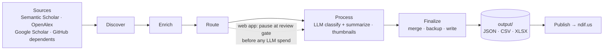
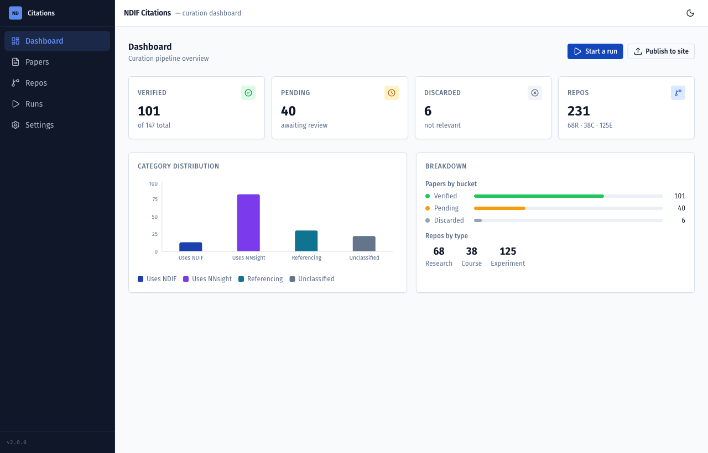

# NDIF Citation Tracker

Automated pipeline to discover, extract metadata for, and catalog all papers citing or using [NDIF](https://ndif.us) (National Deep Inference Fabric) and [NNsight](https://nnsight.net/) — driven from a CLI **or** a local web app.

Replaces a manual workflow of checking Google Scholar, copying metadata into spreadsheets, screenshotting figures, and updating website HTML.


```mermaid
flowchart LR
    SRC["Sources<br/>Semantic Scholar · OpenAlex<br/>Google Scholar · GitHub dependents"]
    SRC --> DISC[Discover] --> ENR[Enrich] --> ROUTE[Route] --> PROC["Process<br/>LLM classify + summarize · thumbnails"] --> FIN["Finalize<br/>merge · backup · write"]
    FIN --> OUT[("output/<br/>JSON · CSV · XLSX")] --> PUB["Publish → ndif.us"]
    ROUTE -. "web app: pause at review gate<br/>before any LLM spend" .-> PROC
```

Two front-ends drive the **same** pipeline: the **CLI** runs it straight through; the **web app** pauses at a review gate so a curator approves candidates before any LLM spend.

## Releases

- **v1.9.0 — CLI app.** Discovery (S2 / OpenAlex / Scholar / GitHub), metadata enrichment, LLM classification with confidence bands, and catalog + spreadsheet output.
- **v2.0.0 — adds the local web app** (`serve`): data-dense dashboard, a curation workspace (browse / edit / promote / discard / reprocess, cached-PDF + figure + evidence views), a run console with a pre-LLM review gate, robust metadata re-enrichment (`re-enrich`), and one-click publish to the site. The CLI is unchanged.
- **v2.1.0 — QA hardening + API-key management.** API Keys settings tab with real credential validation (1-token LLM check, SerpAPI account check), humanized Test results, Clear buttons, and run-start preflight that live-checks keys. Run console now reports *honest* LLM work — distinguishes processed from already-complete papers and previews true work at the review gate (no more "Processing 113/128" for a 1-paper approval). Live runs snapshot the catalog before overwriting it; the seed paper can no longer leak into the gate; abstracts are stripped of raw LaTeX during enrichment; the SPA shell is served `no-store` so a rebuild never serves a stale bundle; PaperSheet opens without a Radix a11y console error.
- **v2.2.0 — run results + PDF curation.** Per-run **Results panel** (what each run added/changed, deep-link straight to a paper), PDF-upload de-dup + attach, a standalone **Backfill evidence** action, ungated manual-add, and evidence de-duplication.
- **v2.3.0 — Publish tab + export + sort.** **Publish** promoted to its own nav tab with what-to-publish (papers / repos) scope, one-click **Export .xlsx** (Papers / Pending / Discarded / GitHub), and a **Date added ↓/↑** sort on the Papers page.
- **v2.3.1 — reliability.** **Cancel** now stops a run mid-Discover/Enrich (not just at the gate), live-run spinner/scroll fixes, and API keys written to `.env` unquoted.
- **v2.4.0 — run history + log polish.** Run history is an **inline accordion** (click a run to expand its details in place; click another to switch), each row can **delete its log** behind a confirm (`DELETE /api/runs/{id}`). Live-run **Cancelled** state shows correctly (was "Done") with the stopped stage amber; the event log no longer floods with cooldown lines (single chip stays, in a fixed-height slot so it doesn't shift the layout); the **Dedup** log line shows real counts; long reprocess **counts** wrap instead of overflowing.

See [Releases](https://github.com/ndif-team/ndif-citations/releases) for notes. A non-coding, end-to-end **[curator walkthrough](onboarding/README.md)** tracks the current (v2.3.1) UI.

## Quick start

```bash
# Install
pip install -e .

# Configure API keys
cp .env.example .env
# Edit .env with your keys

# Discovery only (no LLM keys needed)
python -m ndif_citations discover

# Full pipeline (CLI)
python -m ndif_citations run

# …or drive it from the web app
python -m ndif_citations serve          # → http://127.0.0.1:8723
```

## Web app

A local single-user web UI wraps the same pipeline — no database, no auth, localhost only. The existing JSON output files stay the source of truth.

> 📖 **New here? Start with the [onboarding guide](onboarding/README.md)** — an end-to-end walkthrough (keys → run → review gate → curation → publish) with screenshots.

<p align="center">
  
</p>

```bash
python -m ndif_citations serve           # → http://127.0.0.1:8723 (opens a browser)
python -m ndif_citations serve --no-open # don't auto-open
python -m ndif_citations serve --port 9000
```

The server (FastAPI) hosts a React SPA plus a JSON API at `/api` (`/docs` for Swagger). It runs **one pipeline at a time**; mutating endpoints return `409` while a run is active.

| Screen | What it does |
|--------|--------------|
| **Dashboard** | Catalog KPIs and category breakdown |
| **Papers** | Browse / filter / sort (incl. **date added**) the catalog, inline-edit 16 curated fields, promote / demote / discard, batch-reprocess, manage thumbnails, attach PDFs, **backfill evidence**, on-demand summarize / categorize. Flags column marks curator-locked (🔒) and missing-metadata (⚠) rows |
| **Runs** | Trigger a run, watch live progress over SSE (phase stepper, per-source rate-limit cooldowns, event log), cancel (stops mid-run), browse history, and review a finished run's **Results panel**. **Incremental runs pause at a review gate before any LLM spend** — the gate previews the *true* work (your selected candidates + automatic gap-fills, with already-complete papers skipped) so you approve first |
| **Repos** | Browse / edit / exclude discovered GitHub repos |
| **Publish** | Push the curated catalog to the `ndif-website` site — choose what to publish (papers / repos), preview with a **dry-run diff**, then apply. Also **Export .xlsx** (full catalog workbook) |
| **Settings** | Edit pipeline knobs and known venues; manage **API keys** (validate with a live Test, clear) |

Everything the UI does maps to a CLI command, so the two workflows are interchangeable.

### Classification confidence bands

Every classified paper carries a `category_confidence_band` (categorical) alongside the legacy `category_confidence` float:

| Band | Float equiv | When | Bucket |
|---|---|---|---|
| `CERTAIN` | 1.00 | `manual_override=True` OR pre-filter caught explicit non-use ("alternative to NDIF") | VERIFIED |
| `HIGH` | 0.85 | LLM verdict with ≥2 surviving context windows OR `linked_paper_tier ≤ 2` cross-link | VERIFIED |
| `MEDIUM` | 0.55 | LLM verdict on a single context window OR abstract-only OR pre-filter caught comparison-table / acks-only | PENDING (`MEDIUM_CONFIDENCE`) |
| `LOW` | 0.30 | Keyword fallback (LLM unavailable / errored) | PENDING (`LOW_CONFIDENCE`) |
| `NONE` | 0.00 | UNCLASSIFIED (no evidence / LLM unparseable) | PENDING (`UNCLASSIFIED_*`) |

`manual_override=True` papers route to `FILL_GAPS` if any `has_*` flag is False, so the pipeline backfills empty description / thumbnail / affiliations on the next run without overwriting curated values.

## Commands

| Command | Description |
|---------|-------------|
| `python -m ndif_citations run` | Full pipeline: discover papers + repos, enrich, process, output |
| `python -m ndif_citations run --fresh` | Full pipeline, ignoring all existing output |
| `python -m ndif_citations run --skip-github` | Papers only — skip GitHub repo discovery |
| `python -m ndif_citations run --skip-papers` | GitHub repos only — skip S2/OpenAlex/Scholar/LLM |
| `python -m ndif_citations discover` | Discovery only — list papers and repos, no LLM calls |
| `python -m ndif_citations serve [--port 8723] [--no-open]` | Launch the local web app (FastAPI + React) — see [Web app](#web-app) |
| `python -m ndif_citations add <url>` | Process a single paper by URL and append to output |
| `python -m ndif_citations add-pdf <file>` | Add a single paper from a local PDF (cached, then processed) |
| `python -m ndif_citations attach-pdf <id> <file>` | Attach / replace a paper's cached PDF (for re-extraction) |
| `python -m ndif_citations edit <id>` | Interactively override any of 16 curated fields on one paper (sets `manual_override=True`) |
| `python -m ndif_citations edit <id> --set field=value` | One-shot field edit, scriptable. Repeat `--set` for multiple fields. Add `--yes` to skip confirm. |
| `python -m ndif_citations reclassify [--ids X,Y]` | Re-run LLM classify on existing papers (apply new pre-filter / band rules) |
| `python -m ndif_citations re-enrich [--ids X,Y] [--fields …] [--dry-run]` | No-LLM: reconcile abstract/authors/affiliations/year + identifiers from authoritative sources (OpenAlex/arXiv) — fixes thin Google-Scholar metadata and strips raw LaTeX. Respects `manual_override`. `--dry-run` previews. |
| `python -m ndif_citations backfill-evidence [--ids X,Y] [--dry-run]` | No-LLM: populate each paper's NDIF context windows (`ndif_context_windows`) from its cached PDF, shown in the web Evidence panel |
| `python -m ndif_citations backfill-thumbnails [--ids X,Y] [--dry-run]` | No-LLM: render a figure thumbnail (PyMuPDF + Surya) for papers missing an image, using the cached PDF (downloads if needed). Id-less papers are skipped. `--dry-run` classifies candidates without downloading/rendering. |
| `python -m ndif_citations promote <id>` | Move paper to verified, freeze with `manual_override=True` |
| `python -m ndif_citations demote <id> --reason ...` | Move paper to pending, freeze with `manual_override=True` |
| `python -m ndif_citations discard <id>` | Move paper to discarded, freeze with `manual_override=True` |
| `python -m ndif_citations debug <id>` | Read-only trace for one paper (PDF cache, keyword hits, classification state) |

All commands accept `--output-dir <path>` and `--verbose` flags.

## Output

Each run merges into existing output and reports what changed:

```
★ 5 NEW papers added
✓ 47 already in database
✓ 2 papers updated (venue upgraded)
```

Use `--fresh` to rebuild from scratch.

```
output/
├── research-papers.json       # Website-ready papers (matches ResearchPaper TS interface)
├── research-papers-full.json  # Full paper metadata — persistent state between runs
├── research-papers.csv        # Extended paper columns for spreadsheet / grant reporting
├── github-repos.json          # Website-ready GitHub repos (all nnsight dependents)
├── github-repos-full.json     # Full repo metadata — persistent state between runs
├── github-repos.csv           # Extended repo columns
├── research-data.xlsx         # Two-sheet spreadsheet: "Papers" + "GitHub"
├── images/                    # Extracted paper thumbnails
├── backups/                   # Timestamped catalog snapshots (taken before each run / tool overwrites)
└── raw/                       # Raw API responses for debugging
```

## How it works

The pipeline runs as five stages (`orchestrator.py`): **discover → enrich → route → process → finalize**. The diagram above shows the full flow.

<details>
<summary><strong>1. Discovery</strong> — find papers and repos across four sources</summary>

<br/>

- **Semantic Scholar** — traverses the citation graph of the [NDIF seed paper](https://arxiv.org/abs/2407.14561) (ICLR 2025). Catches every paper that formally cites NDIF/NNsight.
- **OpenAlex** — fulltext search across millions of papers. Catches papers that mention NDIF in their text but may not have a formal citation yet.
- **Google Scholar** (via SerpAPI, optional) — recovers papers whose citation linkage S2/OpenAlex miss. Silently skipped if `SERPAPI_API_KEY` is unset; cached 24h.
- **GitHub dependents** — scrapes the [nnsight dependents page](https://github.com/ndif-team/nnsight/network/dependents) and captures **every non-fork, non-archived repo** as a first-class `DiscoveredRepo`. READMEs are scanned for arXiv links (cross-linking to papers) and NDIF keywords (classification). Activity metadata (stars, forks, last commit, language, license, topics) is fetched via the GitHub API. Stale repos (404 / renamed / archived since last run) are removed on the next run.

**GitHub repo classification** — in a single pass during enrichment, each repo is tagged `research` / `course` / `experiment`, gets a 5-tier `linked_paper_url` detection, and goes through shared-paper template cleanup (≥ `SHARED_PAPER_THRESHOLD` repos sharing a link → only the top-star repo keeps it). The dependents scrape checkpoints each page to `output/raw/` so an interrupted scrape resumes.

The seed paper itself is excluded in all of its variant forms (arXiv id / DOI / normalized-fuzzy title). Results are deduplicated by arXiv ID, DOI, and title similarity (>90% via `rapidfuzz`); S2 is preferred for structured fields, OpenAlex for affiliations.

</details>

<details>
<summary><strong>2. Enrichment</strong> — normalize venues, reconcile metadata, detect peer review</summary>

<br/>

- **Venue formatting** — normalized to website convention (`"ICLR 2025"`, `"ArXiv 2025"`, `"NeurIPS 2024 Workshop on..."`), driven by `data/known_venues.json`.
- **Peer-review detection** — papers at known conferences/journals/workshops flagged as peer-reviewed (for NSF reporting).
- **Robust metadata reconciliation** (`enrichment.py`) — repair-only fill of abstract / authors / affiliations / year + identifiers from authoritative sources (OpenAlex / arXiv), fixing thin or truncated Google-Scholar metadata. Strips raw LaTeX (`\textbf{}`, `\textit{}`) from abstracts. Never overwrites a good value or a curator-locked (`manual_override`) field.
- **BibTeX generation** — auto-generated from structured metadata.

</details>

<details>
<summary><strong>3. Route</strong> — decide what (if anything) each paper needs before spending on the LLM</summary>

<br/>

The early router (`router.py`) compares each discovered paper against the existing catalog and buckets it:

- **NEW** — not in the catalog → full processing.
- **REPROCESS** — content hash or venue changed (e.g. arXiv → conference) → full reprocessing.
- **FILL_GAPS** — same content, missing fields → backfill only the gaps.
- **SKIP** — unchanged and complete → copied through, no LLM.
- **PROTECTED** — `manual_override=True` → never overwritten (gap-fills empties only).

In the web app, incremental runs **pause at a review gate** here: NEW/REPROCESS candidates are surfaced for approval, and the gate previews the true work (selected candidates + automatic FILL_GAPS, with SKIP/PROTECTED skipped) before any LLM spend. The CLI runs straight through.

</details>

<details>
<summary><strong>4. Process</strong> — LLM classification, summaries, thumbnails</summary>

<br/>

For each paper that needs work:

1. **PDF download** — fetched once from open-access URL or arXiv, cached, shared across steps.
2. **Context extraction** — PDF text searched for keyword mentions; up to 5 context windows (500 chars each).
3. **LLM classification** — `uses_ndif` (runs on NDIF infrastructure) / `uses_nnsight` (uses the library) / `referencing` (mentions without active use).
4. **LLM summary** — abstract summarized into 1–3 sentences for the website.
5. **Thumbnail extraction** — smart figure detection (PyMuPDF + Surya), scoring candidates by caption quality, size/aspect, and section context; extracts the best representative figure as PNG.

If the LLM is unavailable, rule-based fallbacks handle classification (keyword matching) and summarization (first 2 sentences of abstract).

</details>

<details>
<summary><strong>5. Finalize</strong> — back up, merge, write, detect upgrades</summary>

<br/>

- **Pre-run backup** — the existing catalog is snapshotted to `output/backups/*.pre-run.json` before anything is overwritten, so a run is recoverable.
- New results merge into `research-papers-full.json`: matches by arXiv ID / DOI / title similarity, appends genuinely new papers, fills metadata gaps, detects **venue upgrades** (arXiv → conference), and respects `manual_override` (hand-edited papers are never overwritten).
- **GitHub repo staleness** — repos that 404 / were renamed / became archived since the last run are purged from `github-repos-full.json`. Rate-limit responses never trigger removal.

</details>

## Project structure

```
src/ndif_citations/
├── cli.py            # Click CLI (run, discover, serve, add, edit, re-enrich, …)
├── config.py         # Constants: seed IDs, keywords, rate limits, thresholds
├── models.py         # Pydantic models (papers, repos, run records)
├── discover.py       # Discovery: S2 · OpenAlex · Scholar · GitHub dependents
├── enrichment.py     # Robust metadata reconcile (OpenAlex/arXiv, repair-only, LaTeX strip)
├── extract.py        # Venue / peer-review / affiliation extraction
├── router.py         # Early router: new / reprocess / fill-gaps / skip / protected
├── process.py        # LLM classify + summarize · thumbnail extraction
├── orchestrator.py   # Stage runner: discover → enrich → route → process → finalize
├── output.py         # Merge, JSON/CSV/XLSX, pre-run backup, CLI report
├── publish.py        # Publish catalog → ndif.us site (dry-run diff → apply)
├── jobs.py           # Web app: single-run job runner + review gate (SSE)
├── manual_add.py     # Seed a gated run from a URL / PDF
├── reprocess.py      # Re-run summarize / classify on existing papers
├── pdf_cache.py      # Cached PDF fetch / store
├── preflight.py      # Pre-run key / credential checks
├── key_validation.py # Live API-key validation (LLM / S2 / GitHub / SerpAPI)
├── secrets_store.py  # .env-backed key storage
├── settings_store.py # Pipeline settings persistence
├── venue.py          # Venue formatting / typing
├── events.py         # Progress event bus (SSE sink)
├── utils.py          # PDF, slugify, dedup, LaTeX strip, arXiv helpers
└── server/           # FastAPI app
    ├── app.py        #   create_app + SPA host
    ├── routers/      #   papers · repos · runs · settings · keys · publish · images · stats
    └── services/     #   papers_svc · repos_svc

web/                  # Vite + React + Tailwind SPA (built to web/dist, served by `serve`)
onboarding/           # End-to-end curator walkthrough (README + screenshots)
data/known_venues.json
```

## Environment variables

| Variable | Required | Description |
|----------|----------|-------------|
| `LLM_BASE_URL` | For `run` | OpenAI-compatible LLM endpoint |
| `LLM_API_KEY` | For `run` | API key for the LLM provider |
| `LLM_MODEL` | For `run` | Model identifier |
| `S2_API_KEY` | No | Semantic Scholar API key (higher rate limits) |
| `SERPAPI_API_KEY` | No | Enables Google Scholar discovery (free tier ≈ 250 calls/mo; ~9 calls/run). Unset → Scholar source is skipped. |
| `OPENALEX_EMAIL` | No | Email for OpenAlex polite pool |
| `GITHUB_TOKEN` | No | GitHub PAT — upgrades GitHub API from 60 req/hr (anonymous) to 5000 req/hr. Without it, activity fields (stars, forks, last_commit) may be null beyond the first ~30 repos per run. No scopes needed for public repos. |

LLM keys are only needed for `run` (summaries + classification); `discover` works without them. In the web app, set and validate keys from **Settings → API Keys** (they're written to `.env`).

<details>
<summary><strong>LLM provider examples</strong></summary>

The LLM integration is provider-agnostic via the `openai` Python library:

```bash
# NVIDIA Build (default, free tier)
LLM_BASE_URL=https://integrate.api.nvidia.com/v1
LLM_MODEL=meta/llama-3.1-70b-instruct

# OpenAI
LLM_BASE_URL=https://api.openai.com/v1
LLM_MODEL=gpt-4o-mini

# Local (Ollama)
LLM_BASE_URL=http://localhost:11434/v1
LLM_MODEL=llama3.1
```

</details>

## Configuration

<details>
<summary><strong>Discovery and classification keywords</strong> — <code>config.py</code></summary>

<br/>

**Discovery keywords** — what OpenAlex searches for in paper full text:

```python
OPENALEX_SEARCH_QUERIES = [
    "nnsight",                            # library name
    '"national deep inference fabric"',   # full project name (exact phrase)
    "ndif.us",                            # project URL
]
```

**PDF classification keywords** — searched in downloaded PDFs to extract context for the LLM:

```python
NDIF_KEYWORDS = ["nnsight", "NNsight", "NDIF", "ndif.us", "nnsight.net", "import nnsight"]
```

If a PDF contains none of these, the paper defaults to `referencing` without an LLM call.

**Seed paper** — root of the Semantic Scholar citation graph:

```python
SEED_ARXIV_ID = "2407.14561"
```

**Rate limits** — adjust for authenticated API keys with higher quotas:

```python
S2_RATE_LIMIT_SLEEP = 3.0       # unauthenticated
LLM_RATE_LIMIT_SLEEP = 12.0     # NVIDIA Build free tier
OPENALEX_RATE_LIMIT_SLEEP = 0.15
SCHOLAR_RATE_LIMIT_SLEEP = 1.0
```

</details>

<details>
<summary><strong>Venue recognition</strong> — <code>data/known_venues.json</code></summary>

<br/>

Controls venue formatting, peer-review detection, and venue-type classification:

```json
{
  "conferences": ["ICLR", "NeurIPS", "ICML", "..."],
  "journals": ["JMLR", "TMLR", "Nature", "..."],
  "preprint_servers": ["ArXiv", "BiorXiv", "..."]
}
```

Matching is case-insensitive substring — adding `"WCCI"` matches `"2026 IEEE WCCI"`, etc.

</details>

<details>
<summary><strong>GitHub repo classification</strong> — <code>config.py</code></summary>

<br/>

| Config constant | Default | Description |
|---|---|---|
| `EXCLUDED_GITHUB_REPOS` | `{"ndif-team/nnsight"}` | Repos to exclude entirely from output (e.g. the library itself) |
| `KNOWN_COURSE_SOURCES` | `{"callummcdougall/ARENA_3.0"}` | Repos whose forks are tagged `course`. Extend as new course templates are discovered. |
| `COURSE_NAME_PATTERNS` | `["ARENA", "MATS", "CBAI"]` | Case-insensitive substrings in repo name or description that signal course origin |
| `SHARED_PAPER_THRESHOLD` | `5` | Minimum number of repos sharing a `linked_paper_url` to trigger template detection |

</details>

## Development

Run tests: `pytest tests/` (after `pip install -e ".[dev]"`).

The web UI lives in `web/` (Vite + React + Tailwind). Rebuild after frontend edits — `serve` ships the prebuilt `web/dist`:

```bash
cd web && bun install && bun run build   # → web/dist (served by `serve`)
bun run dev                              # Vite dev server, proxies /api → :8723
```

## License

Internal tool for [NDIF](https://ndif.us) — an NSF-funded project at Northeastern University.
