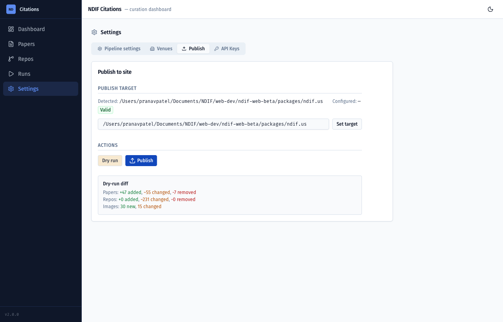

# NDIF Citations — Curation App Walkthrough

A hands-on guide to the NDIF Citations web app: discovering papers and GitHub repos
that cite NDIF/NNsight, reviewing them, cleaning up their metadata, and publishing the
result to the website. Written for curators (hi Emma 👋) — no coding required.

This walks the whole loop end to end:

> **Set up your API keys → start a run → review what it found → process one → tidy it up → publish.**

---

## Table of contents

1. [What this app does](#1-what-this-app-does)
2. [Before you start: API keys](#2-before-you-start-api-keys)
3. [Launching the app](#3-launching-the-app)
4. [Step 1 — Enter your API keys](#4-step-1--enter-your-api-keys)
5. [The Dashboard](#5-the-dashboard)
6. [Step 2 — Start a run](#6-step-2--start-a-run)
7. [Step 3 — Watch it work (live run console)](#7-step-3--watch-it-work-live-run-console)
8. [Step 4 — The review gate (approve / discard)](#8-step-4--the-review-gate-approve--discard)
9. [Step 5 — A processed paper](#9-step-5--a-processed-paper)
10. [Curating papers](#10-curating-papers)
11. [Re-summarize / re-categorize one paper](#11-re-summarize--re-categorize-one-paper)
12. [Add a paper by hand (link or PDF)](#12-add-a-paper-by-hand-link-or-pdf)
13. [GitHub repos](#13-github-repos)
14. [Other settings (pipeline + venues)](#14-other-settings-pipeline--venues)
15. [Publishing to the website](#15-publishing-to-the-website)
16. [Tips & troubleshooting](#16-tips--troubleshooting)

---

## 1. What this app does

The app keeps a catalog of **papers** and **GitHub repos** that cite NDIF / NNsight.
It runs a pipeline that:

- **Discovers** new papers (Semantic Scholar, OpenAlex, Google Scholar) and repos (GitHub),
- **Enriches** them with clean metadata (title, authors, venue, year, abstract),
- **Classifies** each one with an LLM (does it *use NDIF*, *use NNsight*, just *reference* it, or is it unrelated?) and writes a one-paragraph summary,
- lets you **review and edit** everything, then
- **publishes** the approved catalog to the public website.

The catalog lives in JSON files on disk; nothing is sent anywhere until *you* hit Publish.

> **The golden rule:** the pipeline never spends an LLM call on papers until **you approve them at the review gate**. Discovery and enrichment are free; classification/summary (the paid part) only happens after you say go.

---

## 2. Before you start: API keys

The app talks to a few outside services. You'll paste these keys into the app once (Step 1).

| Key | What it's for | Required? | Where to get it |
|---|---|---|---|
| **LLM API Key** | Classifies + summarizes papers (the AI part) | **Required** to process papers | An OpenAI-compatible provider. This project defaults to **NVIDIA NIM** (`integrate.api.nvidia.com`, model `meta/llama-3.1-70b-instruct`) — get a key at [build.nvidia.com](https://build.nvidia.com). Any OpenAI-compatible endpoint works; set the Base URL + Model in **Settings → Pipeline settings**. |
| **GitHub Token** | Discovers + reads repos that depend on NNsight | **Required** to discover repos | A GitHub Personal Access Token: [github.com/settings/tokens](https://github.com/settings/tokens) → *Generate new token*. Public-repo read access is enough. (Anonymous GitHub is ~60 requests/hour, far too few.) |
| **S2 API Key** | Higher-rate Semantic Scholar discovery | Optional (just raises limits) | [semanticscholar.org/product/api](https://www.semanticscholar.org/product/api) |
| **SerpAPI Key** | Google Scholar discovery | Optional | [serpapi.com](https://serpapi.com) |

> You do **not** need every key to start. With just the **LLM key** you can run papers; with just the **GitHub token** you can run repos. The app will tell you if a key you need is missing (and now, if a key is present but *invalid*).

Two contact emails (`OPENALEX_EMAIL`, `UNPAYWALL_EMAIL`) are also used to be polite to those APIs. They live in **Settings → Pipeline settings**, not in the API Keys tab.

---

## 3. Launching the app

From the `ndif-citations` folder:

```bash
pip install -e .
python -m ndif_citations serve
```

This opens the app at **http://127.0.0.1:8723**. It runs only on your machine — no login, no cloud. (If a teammate already started it for you, just open that URL.)

---

## 4. Step 1 — Enter your API keys

Go to **Settings** (left sidebar) → the **API Keys** tab.


- Each key shows a **Configured ✓** / **Not set** badge. The app **never shows you a stored key** — values are write-only, so the boxes always read "leave blank to keep."
- To set or change a key: type/paste it into the box and click **Save keys**. Leaving a box blank keeps the existing value.
- Click **Test** to check a key live:
  - **LLM** runs a tiny 1-token completion (so an invalid key is actually caught, not just "the server is reachable"),
  - **GitHub** / **S2** / **SerpAPI** each hit a lightweight authenticated endpoint.
  - A good key shows **"Valid key"** (green ✓); a bad one shows e.g. *"Invalid or expired key (401)"*.
- **Clear** removes a key (from the on-disk `.env`) when you want to rotate or remove it.

> **Tip:** Test reads the **saved** key, so save a new value before testing it.

---

## 5. The Dashboard

The home screen is a quick health check of the catalog.


- **KPI cards:** Verified / Pending / Discarded papers, and total repos (broken down as Research · Course · Experiment).
- **Category distribution:** how many papers *use NDIF*, *use NNsight*, just *reference* it, or are *unclassified*.
- **Breakdown:** the same numbers as bars.
- **Start a run** / **Publish to site** shortcuts up top.

---

## 6. Step 2 — Start a run

Go to **Runs**. This is where you kick off discovery.


- **Mode:**
  - **Incremental** — find what's *new* since last time (the normal choice).
  - **Fresh** — rebuild from scratch.
- **Skip stages:** run only papers, or only repos (the two toggles are mutually exclusive). In this walkthrough I checked **Skip GitHub repos** so we focus on papers.
- Before it lets you start, the app runs a **preflight check** on your keys. If a required key is missing — or now, if your GitHub token is *present but rejected* — it blocks the run and tells you what to fix, so you don't waste a run discovering nothing.

Click **Start run**.

---

## 7. Step 3 — Watch it work (live run console)

The run streams its progress live.


- A **phase stepper** shows where you are: **Discover → Enrich → Route → Review → Process → Finalize**.
- The **event log** streams every step in real time.
- When an external API asks us to slow down, you'll see a **cooldown** chip (e.g. "S2 cooldown: 0.5s") — that's normal, the run is just being polite to rate limits.
- You can **Cancel** at any time. Cancelling before the gate spends **zero** LLM credit and leaves the catalog untouched.

Discover + Enrich can take a few minutes (lots of polite waiting on external APIs). When it finishes routing, it **pauses and waits for you**.

---

## 8. Step 4 — The review gate (approve / discard)

This is the heart of the app. The run stops at **Review** and shows you the new candidates it found. **Nothing has been classified by the LLM yet.**


Each candidate has a three-way choice:

- **Process** — send it through LLM classification + summary (this is the paid step).
- **Skip** — leave it for next time (the default; no decision yet).
- **Discard** — mark it as not relevant.

(You can also click ✏️ to fix a candidate's fields before processing.) The counter up top tracks your decisions ("1 process · 0 discard · 11 skip"), and the button reads **"Submit & process N"**. In this walkthrough I set **one** paper to Process and left the rest Skipped.

> **Heads up:** after you submit, the run also re-checks your *existing* papers for missing data, so the progress log may show a "Processing X / N" counter **larger than the number you approved**. That's normal — it only actually calls the LLM on papers that genuinely need it (new or with gaps).

---

## 9. Step 5 — A processed paper

After you submit, the run finishes **Process → Finalize** and the run shows **Done** in the history.


The paper you approved now appears on the **Papers** page with a one-paragraph **summary** written and a **category** assigned. Note the category can come back as **"unclassified"** (and the paper sits in **Pending**) if the classifier found no NNsight/NDIF evidence in the text — that's a normal outcome, not an error. You then review it like any other paper. *(In this walkthrough my approved paper, "Interpretability Can Be Actionable," came back unclassified/pending for exactly that reason.)*

That's the full loop: **discover → review → process**. Everything below is about cleaning up and publishing what you've collected.

---

## 10. Curating papers

The **Papers** page is your main workspace.


- **Filter tabs:** All / Verified / Pending / Discarded. Search by title. Sort by year.
- **Flags column** (the little icons): a **lock 🔒** means *curator-locked* (you've hand-edited it, so the pipeline won't overwrite your changes); an **amber dot** means *missing metadata* worth filling in.
- **Needs attention** filters to just the papers with gaps — your to-do list.


Click any row to open the **detail sheet**:


In the detail sheet you can:

- See the **thumbnail** (click to zoom), **abstract**, **affiliations**, links to the **Paper / PDF / Cached PDF**, and the **evidence** snippets the classifier used.
- **Edit any field inline** — click a value (e.g. a missing **Venue**) and type. Editing a field **locks** the paper so a future run won't clobber your work.
- **Promote / Demote / Discard** to move it between Verified / Pending / Discarded.
- **Attach a PDF** (for paywalled papers with no usable link) so thumbnails + evidence can be extracted.
- Move through papers with the **‹ ›** arrows (or ← / → keys).

---

## 11. Re-summarize / re-categorize one paper

If a paper's summary or category looks off, you can re-run just that step from the detail sheet using the **Summarize** and **Categorize** buttons.


- Each asks for confirmation first, because it **spends an LLM call**.
- They're **disabled while a run is active** (only one job runs at a time).
- **Don't re-summarize curator-locked / gold-list papers** — those summaries are intentional.

---

## 12. Add a paper by hand (link or PDF)

Found a paper the pipeline missed? Use **+ Add paper** on the Papers page.


- **By link:** paste a URL (arXiv, DOI, publisher page). The app searches online to confirm the metadata.
- **By PDF:** upload the PDF and give it a title (plus arXiv/DOI if you have them) — for paywalled papers.

Either way it **runs through the same review gate** as a discovered paper: it's enriched, then it pauses for you to approve before any LLM spend. (The **+ Add paper** button is greyed out while another run is in progress.)

---

## 13. GitHub repos

The **Repos** page is the code half of the catalog.


- Filter by **type** (Research / Course / Experiment), search, sort by stars.
- **Type** separates real research repos from course/coursework forks (e.g. ARENA) and one-off experiments.
- **Category** marks whether the repo *uses NDIF*, *uses NNsight*, or just references it.
- Open a repo to edit its type/category, or **exclude** a repo you don't want in the catalog.

---

## 14. Other settings (pipeline + venues)

**Settings → Pipeline settings** controls how discovery + classification behave:


- **Discovery:** minimum paper year, shared-paper threshold.
- **LLM:** model name, base URL, rate-limit sleep.
- **Rate limits:** how long to pause between Semantic Scholar / GitHub calls.
- **Lists:** excluded repos, known course sources, course-name patterns, NDIF keywords, README match/negative patterns.

**Settings → Venues** maps messy venue strings to clean canonical names:


---

## 15. Publishing to the website

When the catalog looks good, **Settings → Publish** pushes it to the website's data files.



- **Always run a dry run first** — it shows exactly what *would* change (added / updated / removed papers and repos) without writing anything.
- Only after the dry run looks right do you apply. The website then needs a rebuild to show the new data.

> Publishing overwrites the site's data files, so treat it like hitting "deploy" — dry-run, eyeball the diff, then apply.

---

## 16. Tips & troubleshooting

- **"I changed something and the UI looks stale."** Refresh the page. (Most state updates live, but a hard refresh never hurts.)
- **A run won't start.** Check **Settings → API Keys** — preflight blocks a run if a required key is missing or your GitHub token is rejected. Hit **Test** to see which.
- **Buttons are greyed out.** Only one job runs at a time. If a run (or a Summarize/Categorize job) is active, edits and new runs are disabled until it finishes — that's expected.
- **A paper has a 🔒 lock.** That means it was hand-edited and is protected from pipeline overwrites. Locked/gold-list papers shouldn't be re-summarized.
- **Cancelling a run is safe.** Before the review gate, cancelling costs nothing and changes nothing.
- **Keys are write-only.** The app never shows a stored key. Use **Test** to confirm one works, **Clear** to remove one.

---

*Questions or something looks broken? Ping the NDIF web-dev team.*
