# NDIF Citations — Curation App Walkthrough

A hands-on guide to the NDIF Citations web app: discovering papers and GitHub repos
that cite NDIF/NNsight, reviewing them, cleaning up their metadata, and publishing the
result to the website. Written for curators (hi Emma 👋) — no coding required.

This walks the whole loop end to end:

> **Set up your API keys → start a run → review what it found → process the keepers → tidy them up → publish.**

> **App version this guide matches: v2.3.1.** The version is shown at the bottom of the
> left sidebar — if yours reads something lower, a few screens below may look slightly
> different (notably **Publish**, which used to live under Settings and is now its own tab).

---

## Table of contents

1. [What this app does](#1-what-this-app-does)
2. [The 30-second mental model](#2-the-30-second-mental-model)
3. [Before you start: API keys](#3-before-you-start-api-keys)
4. [Launching the app](#4-launching-the-app)
5. [Step 1 — Enter your API keys](#5-step-1--enter-your-api-keys)
6. [The app at a glance (the sidebar)](#6-the-app-at-a-glance-the-sidebar)
7. [The Dashboard](#7-the-dashboard)
8. [Step 2 — Start a run](#8-step-2--start-a-run)
9. [Step 3 — Watch it work (live run console)](#9-step-3--watch-it-work-live-run-console)
10. [Step 4 — The review gate (process / skip / discard)](#10-step-4--the-review-gate-process--skip--discard)
11. [Step 5 — The run results panel](#11-step-5--the-run-results-panel)
12. [Confidence, buckets & categories — what the labels mean](#12-confidence-buckets--categories--what-the-labels-mean)
13. [Curating papers](#13-curating-papers)
14. [The paper detail sheet](#14-the-paper-detail-sheet)
15. [Re-summarize / re-categorize one paper](#15-re-summarize--re-categorize-one-paper)
16. [Paywalled papers: attach a PDF → backfill → re-categorize](#16-paywalled-papers-attach-a-pdf--backfill--re-categorize)
17. [Add a paper by hand (link or PDF)](#17-add-a-paper-by-hand-link-or-pdf)
18. [GitHub repos](#18-github-repos)
19. [Settings (pipeline + venues)](#19-settings-pipeline--venues)
20. [Publishing to the website](#20-publishing-to-the-website)
21. [Export a spreadsheet](#21-export-a-spreadsheet)
22. [Tips & troubleshooting](#22-tips--troubleshooting)
23. [Glossary](#23-glossary)

---

## 1. What this app does

The app keeps a catalog of **papers** and **GitHub repos** that cite NDIF / NNsight.
It runs a pipeline that:

- **Discovers** new papers (Semantic Scholar, OpenAlex, Google Scholar) and repos (GitHub),
- **Enriches** them with clean metadata (title, authors, venue, year, abstract),
- **Classifies** each one with an LLM (does it *use NDIF*, *use NNsight*, just *reference* it, or is it unrelated?) and writes a one-paragraph summary,
- lets you **review and edit** everything, then
- **publishes** the approved catalog to the public website.

The catalog lives in JSON files on your own machine; nothing is sent anywhere until *you* hit Publish.

> **The golden rule:** the pipeline never spends an LLM call on papers until **you approve them at the review gate**. Discovery and enrichment are free; classification/summary (the paid part) only happens after you say go.

---

## 2. The 30-second mental model

Two ideas make everything else click:

1. **Bucket vs. category are two different things.**
   - **Bucket** = *where a paper sits in your review pipeline* → **Verified / Pending / Discarded**. Only **Verified** papers get published to the website.
   - **Category** = *what the paper's relationship to NDIF is* → **uses NDIF / uses NNsight / referencing / unclassified**.

2. **Editing a paper "locks" it (🔒).** The moment you hand-edit a field, promote, demote, or discard a paper, it's marked *curator-locked*. From then on the pipeline **never overwrites your work** — it will only fill in fields you left blank. This is your veto. Set the things you care about and let the pipeline handle the rest.

Everything below is just these two ideas applied to one screen at a time.

---

## 3. Before you start: API keys

The app talks to a few outside services. You'll paste these keys into the app once (Step 1).

| Key | What it's for | Required? | Where to get it |
|---|---|---|---|
| **LLM API Key** | Classifies + summarizes papers (the AI part) | **Required** to process papers | An OpenAI-compatible provider. This project defaults to **NVIDIA NIM** (`integrate.api.nvidia.com`, model `meta/llama-3.1-70b-instruct`) — get a key at [build.nvidia.com](https://build.nvidia.com). Any OpenAI-compatible endpoint works; set the Base URL + Model in **Settings → Pipeline settings**. |
| **GitHub Token** | Discovers + reads repos that depend on NNsight | **Required** to discover repos | A GitHub Personal Access Token: [github.com/settings/tokens](https://github.com/settings/tokens) → *Generate new token*. Public-repo read access is enough. (Anonymous GitHub is ~60 requests/hour — far too few.) |
| **S2 API Key** | Higher-rate Semantic Scholar discovery | Optional (just raises limits) | [semanticscholar.org/product/api](https://www.semanticscholar.org/product/api) |
| **SerpAPI Key** | Google Scholar discovery | Optional | [serpapi.com](https://serpapi.com) |

> You do **not** need every key to start. With just the **LLM key** you can run papers; with just the **GitHub token** you can run repos. The app tells you at run time if a key you need is missing — or present but *invalid*.

Two contact emails (`OPENALEX_EMAIL`, `UNPAYWALL_EMAIL`) are also used to be polite to those APIs. They live in **Settings → Pipeline settings**, not in the API Keys tab.

---

## 4. Launching the app

From the `ndif-citations` folder:

```bash
pip install -e .
python -m ndif_citations serve
```

This opens the app at **http://127.0.0.1:8723**. It runs only on your machine — no login, no cloud. (If a teammate already started it for you, just open that URL.)

Useful variants:

```bash
python -m ndif_citations serve --no-open    # don't auto-open a browser
python -m ndif_citations serve --port 9000  # use a different port
```

---

## 5. Step 1 — Enter your API keys

Go to **Settings** (left sidebar) → the **API Keys** tab.

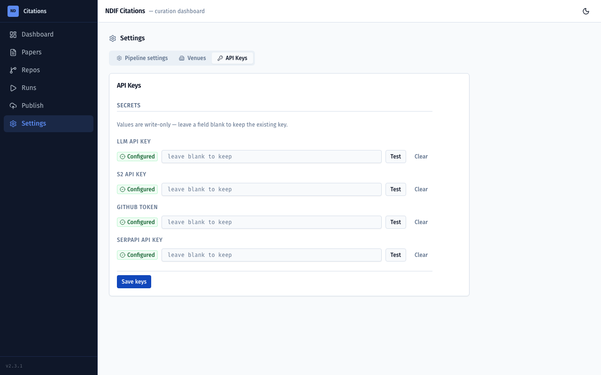

- Each key shows a **Configured ✓** / **Not set** badge. The app **never shows you a stored key** — values are write-only, so the boxes always read "leave blank to keep."
- To set or change a key: type/paste it into the box and click **Save keys**. Leaving a box blank keeps the existing value.
- Click **Test** to check a key live:
  - **LLM** runs a tiny 1-token completion (so an invalid key is actually caught, not just "the server is reachable"),
  - **GitHub** / **S2** / **SerpAPI** each hit a lightweight authenticated endpoint.
  - A good key shows **"Valid key"** (green ✓); a bad one shows e.g. *"Invalid or expired key (401)"*.
- **Clear** removes a key (from the on-disk `.env`) when you want to rotate or remove it.

> **Tip:** Test reads the **saved** key, so save a new value before testing it.

---

## 6. The app at a glance (the sidebar)

Six screens, top to bottom in the left sidebar:

| Screen | What it's for |
|---|---|
| **Dashboard** | A health check of the catalog — counts and category breakdown. |
| **Papers** | Your main workspace — browse, filter, edit, promote/discard papers. |
| **Repos** | The GitHub-repo half of the catalog. |
| **Runs** | Kick off a discovery run, watch it live, review what it found. |
| **Publish** | Push the approved catalog to the website (and export a spreadsheet). |
| **Settings** | API keys, pipeline knobs, and venue name mappings. |

The app runs **one job at a time**. While a run (or a single-paper Summarize/Categorize/Backfill) is active, editing and starting new runs are disabled — that's expected, not a bug.

---

## 7. The Dashboard

The home screen is a quick health check of the catalog.


- **KPI cards:** Verified / Pending / Discarded papers, and total repos (broken down as Research · Course · Experiment).
- **Category distribution:** how many papers *use NDIF*, *use NNsight*, just *reference* it, or are *unclassified*.
- **Breakdown bars:** the same numbers visualized.
- **Start a run** / **Publish to site** shortcuts up top.

---

## 8. Step 2 — Start a run

Go to **Runs**. This is where you kick off discovery.

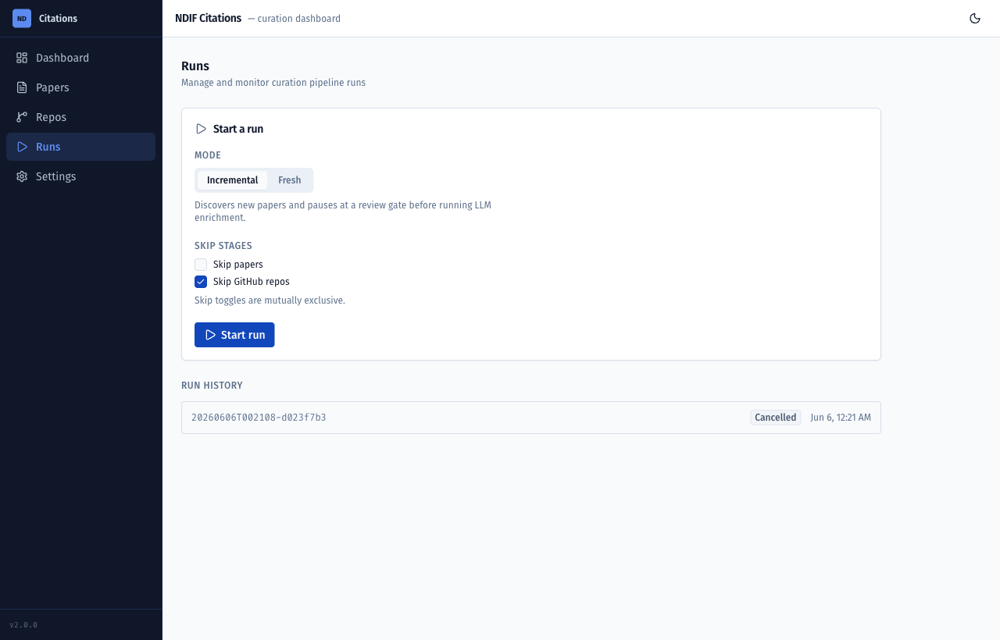

- **Mode:**
  - **Incremental** — find what's *new* since last time (the normal choice; this is the mode that pauses at the review gate).
  - **Fresh** — rebuild from scratch.
- **Skip stages:** run only papers, or only repos (the two toggles are mutually exclusive). In this walkthrough I checked **Skip GitHub repos** so we focus on papers.
- Before it lets you start, the app runs a **preflight check** on your keys. If a required key is missing — or your GitHub token is *present but rejected* — it blocks the run and tells you exactly what to fix, so you don't waste a run discovering nothing.

Click **Start run**.

---

## 9. Step 3 — Watch it work (live run console)

The run streams its progress live.

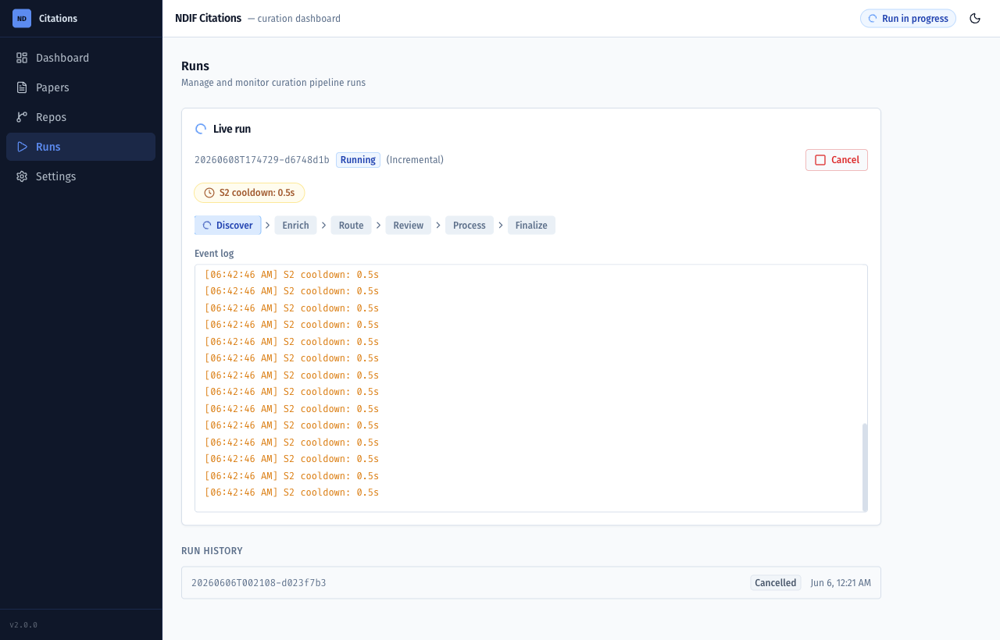

- A **phase stepper** shows where you are: **Discover → Enrich → Route → Review → Process → Finalize**. (The **Review** step only appears for Incremental runs — that's the gate.)
- The **event log** streams every step in real time.
- When an external API asks us to slow down, you'll see a **cooldown** chip (e.g. "S2 cooldown: 0.5s") — that's normal, the run is just being polite to rate limits.
- You can **Cancel** at any time. Cancelling **before the gate spends zero LLM credit** and leaves the catalog untouched. (As of v2.3.1, Cancel reliably stops the run even mid-Discover/Enrich — you won't have to wait for the current step to finish.)

Discover + Enrich can take a few minutes (lots of polite waiting on external APIs). When it finishes routing, it **pauses and waits for you** at the gate.

---

## 10. Step 4 — The review gate (process / skip / discard)

This is the heart of the app. The run stops at **Review** and shows you the new candidates it found. **Nothing has been classified by the LLM yet.**

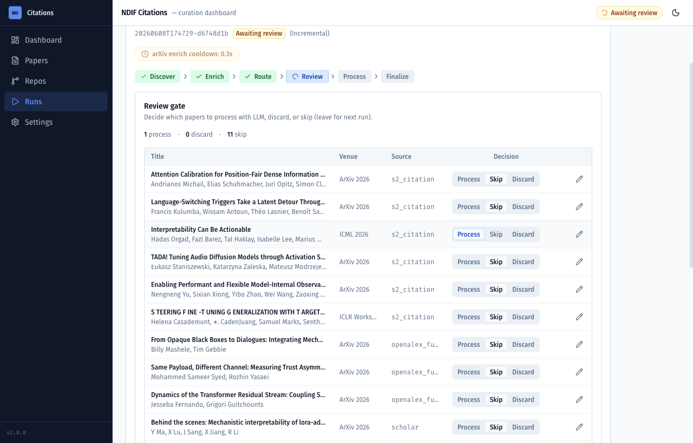

Each candidate has a three-way choice:

- **Process** — send it through LLM classification + summary (this is the paid step).
- **Skip** — leave it for next time (the default; no decision yet).
- **Discard** — mark it as not relevant.

(You can also click ✏️ to fix a candidate's fields before processing.) The counter up top tracks your decisions ("1 process · 0 discard · 11 skip"), and the button reads **"Submit & process N"**. In this walkthrough I set **one** paper to Process and left the rest Skipped.

> **Heads up:** after you submit, the run also re-checks your *existing* papers for missing data, so the progress log may show a "Processing X / N" counter **larger than the number you approved**. That's normal — it only actually calls the LLM on papers that genuinely need it (new candidates + papers with real gaps), and it logs *"Skipped (already complete)"* for the rest.

---

## 11. Step 5 — The run results panel

When the run finishes **Process → Finalize**, select it in **Run history** and the Runs screen shows a **Results panel** summarizing what changed this run.

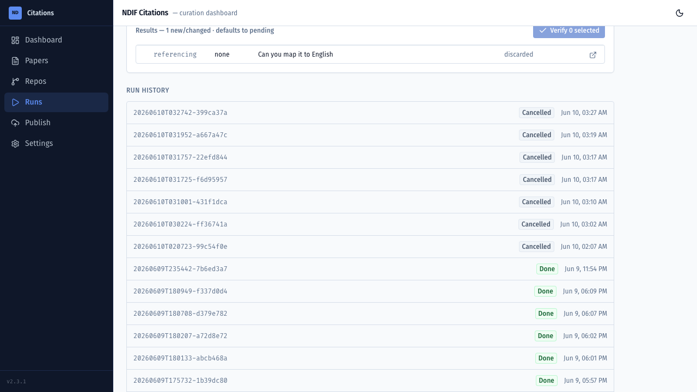

- It's titled **"Results — N new/changed · defaults to pending."** Freshly-processed papers land in **Pending** for your review, even if the LLM classified them confidently — *you* decide what gets verified.
- Each row has two quick actions:
  - **Discard** — drop a result you can already tell is irrelevant (for a manually-added paper this *permanently deletes* it, with a confirm; for a discovered paper it just moves it to Discarded).
  - **Open** (↗) — jumps straight to that paper's detail sheet on the Papers page, so you can review it immediately.

This is your "what did this run actually do?" summary. From here you typically click **Open** on each new paper and review it like any other (next sections).

> A paper's category can come back as **"unclassified"** if the classifier found no clear NNsight/NDIF evidence in the text — that's a normal outcome, not an error. It just sits in Pending until you look at it.

That's the full loop: **discover → review → process → results**. Everything below is about cleaning up and publishing what you've collected.

---

## 12. Confidence, buckets & categories — what the labels mean

When you open a paper you'll see a few labels. Here's how to read them.

**Bucket** (where it sits in your review pipeline):

| Bucket | Meaning |
|---|---|
| **Verified** | Reviewed and good. **Only Verified papers publish to the website.** |
| **Pending** | Needs your attention — new, low-confidence, or missing data. Your work queue. |
| **Discarded** | Not relevant. Kept for the record, never published. |

**Category** (the paper's relationship to NDIF):

| Category | Meaning |
|---|---|
| **uses NDIF** | Actually ran experiments on NDIF infrastructure. |
| **uses NNsight** | Uses the NNsight library. |
| **referencing** | Mentions NDIF/NNsight without actively using it. |
| **unclassified** | The classifier couldn't find clear evidence either way. |

**Confidence** — *how sure the classifier was.* It shows in the **Conf.** column on the Papers table (and on each run-results row), and as a badge on the paper detail sheet, lowercased:

| Conf. | What it means for you |
|---|---|
| **certain** | Locked-in (e.g. you hand-set it, or the text explicitly says it does *not* use NDIF). |
| **high** | Strong evidence — multiple clear mentions in the PDF. Usually safe to verify. |
| **medium** | Thin evidence — a single mention, or only the abstract was available. **Worth a look.** Lands in Pending. |
| **low** | Guessed from keywords because the LLM was unavailable. Re-run with the LLM and it usually upgrades. Lands in Pending. |
| **none** | Unclassified — no confidence shown. |

The short version: **anything that lands in Pending is asking for your eyes.** *medium* and *low* are the ones most worth verifying by hand.

---

## 13. Curating papers

The **Papers** page is your main workspace.

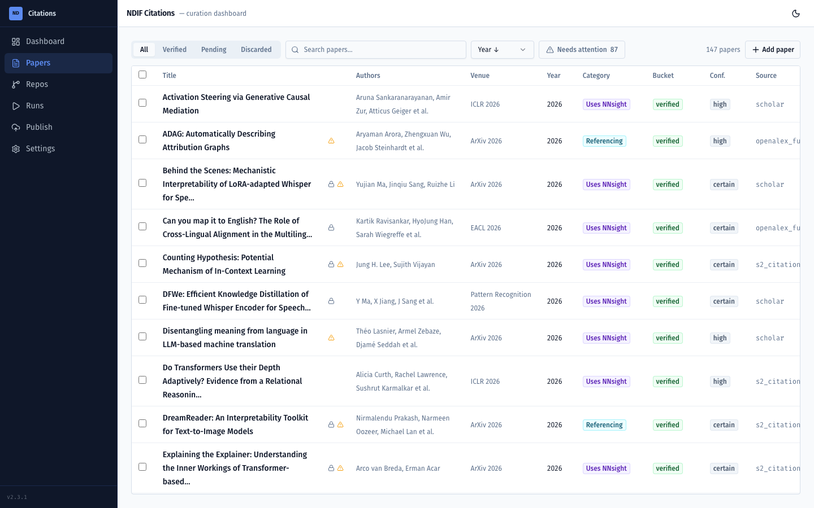

- **Filter tabs:** All / Verified / Pending / Discarded. Search by title.
- **Sort:** Year ↓/↑, Title, or **Date added ↓/↑**. *Date added ↓* is the fastest way to surface the papers a run just brought in.
- **Flags column** (the little icons): a **lock 🔒** means *curator-locked* (you've hand-edited it, so the pipeline won't overwrite your changes); an **amber dot** means *missing metadata* worth filling in.
- **Needs attention** toggle filters to just the papers with gaps — your to-do list.

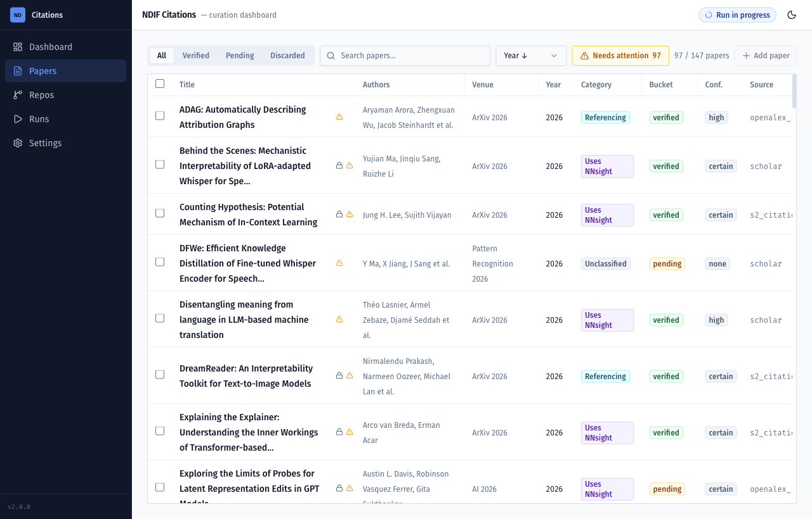

Click any row to open the **detail sheet** (next section).

---

## 14. The paper detail sheet

Click a paper to open its detail sheet.

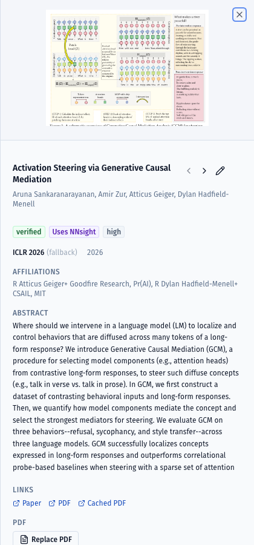

The top of the sheet shows the **bucket** badge (e.g. `verified`), the **category** badge (e.g. `Uses NNsight`), and the **confidence** badge (e.g. `high`), plus the **thumbnail** (click to zoom), **affiliations**, and the **abstract**. Here you can:

- **Edit any field inline** — click a value (e.g. a missing **Venue**) and type. Editing a field **locks** the paper (🔒) so a future run won't clobber your work.
- See links to the **Paper / PDF / Cached PDF** and the **evidence** snippets the classifier used.

Scroll down for the action buttons:

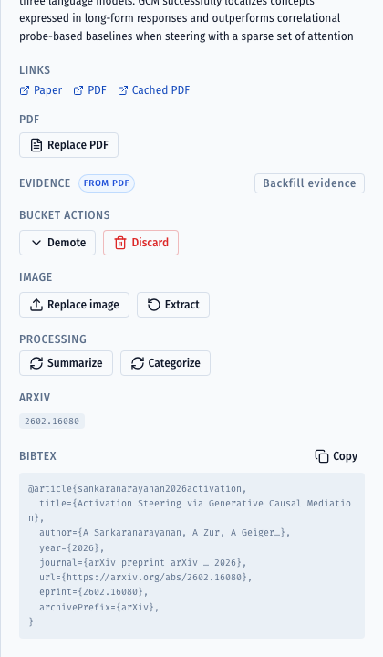

- **Promote / Demote / Discard** to move it between Verified / Pending / Discarded. (Demote asks for a reason. Discarding a *manually-added* paper offers to delete it permanently instead of just parking it.)
- **Replace PDF** / **Attach PDF** — for paywalled papers with no usable link (see [§16](#16-paywalled-papers-attach-a-pdf--backfill--re-categorize)).
- **Backfill evidence** — a free, no-LLM action that re-reads the cached PDF and refreshes the evidence snippets shown in the Evidence panel.
- **Extract** (re-run thumbnail extraction) or **Replace image** with your own upload.
- **Summarize / Categorize** — re-run just that one AI step (see [§15](#15-re-summarize--re-categorize-one-paper)).
- Move through papers with the **‹ ›** arrows (or ← / → keys).

---

## 15. Re-summarize / re-categorize one paper

If a paper's summary or category looks off, you can re-run just that step from the detail sheet using the **Summarize** and **Categorize** buttons.

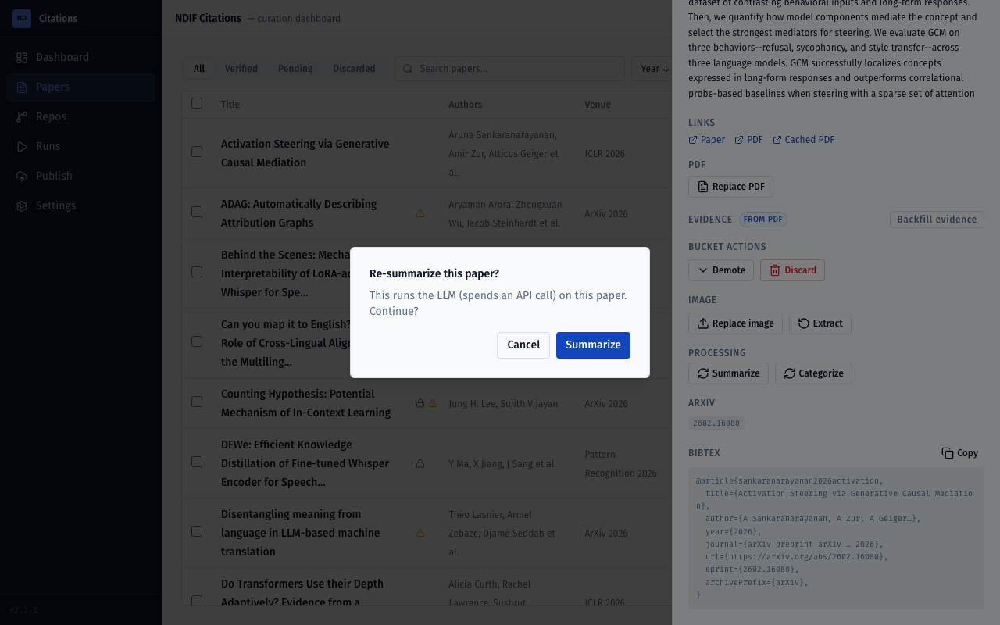

- Each asks for confirmation first, because it **spends an LLM call**.
- They're **disabled while a run is active** (only one job runs at a time).
- **Don't re-summarize curator-locked / gold-list papers** — those summaries are intentional.

> **Free vs. paid:** *Backfill evidence* and *Extract* (thumbnail) are **free** — no LLM. *Summarize* and *Categorize* **cost an LLM call**. When in doubt, backfill evidence first (free) and only re-categorize (paid) if the evidence changed.

---

## 16. Paywalled papers: attach a PDF → backfill → re-categorize

Some papers have no open-access PDF the pipeline can fetch (theses, Elsevier/Springer/ProQuest, paywalled journals). For these, the classifier only had the *abstract* to work with — which is unreliable. If you can get the full PDF, here's how to give the app a proper look:

1. Open the paper's detail sheet and click **Attach PDF** (or **Replace PDF**), then choose the file.
2. The app offers: **"PDF attached — run a backfill?"** Say yes. This re-reads the new PDF and refreshes the **evidence** snippets — **for free** (no LLM).
3. Now look at the evidence. If it changed meaningfully, click **Categorize** to re-classify from the full text (this spends one LLM call).
4. If the result is right, **Promote** to Verified.

> **Why this matters:** never decide a paper is irrelevant from its abstract alone. The abstract often doesn't mention the tool even when the methods section uses it heavily. Attach the PDF and let the classifier read the real thing before you discard anything paywalled.

---

## 17. Add a paper by hand (link or PDF)

Found a paper the pipeline missed? Use **+ Add paper** on the Papers page.

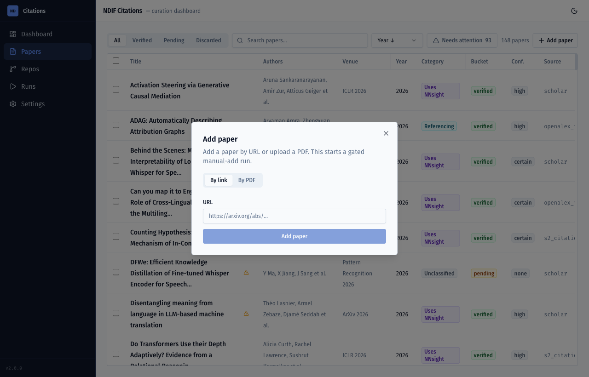

- **By link:** paste a URL (arXiv, DOI, publisher page). The app searches online to confirm the metadata.
- **By PDF:** upload the PDF and give it a title (plus arXiv/DOI if you have them) — for paywalled papers.
- If the title looks like one already in the catalog, the app shows a **"this may already exist"** prompt so you don't create a duplicate.

Either way it **runs through the same review gate** as a discovered paper: it's enriched, then it pauses for you to approve before any LLM spend. (The **+ Add paper** button is greyed out while another run is in progress.)

---

## 18. GitHub repos

The **Repos** page is the code half of the catalog.

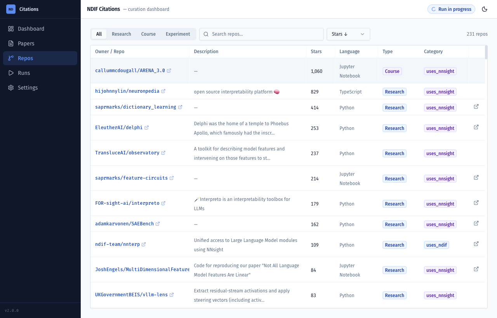

- Filter by **type** (Research / Course / Experiment), search, sort by stars.
- **Type** separates real research repos from course/coursework forks (e.g. ARENA) and one-off experiments.
- **Category** marks whether the repo *uses NDIF*, *uses NNsight*, or just references it.
- Open a repo to edit its type/category, or **exclude** a repo you don't want in the catalog.

---

## 19. Settings (pipeline + venues)

**Settings → Pipeline settings** controls how discovery + classification behave:

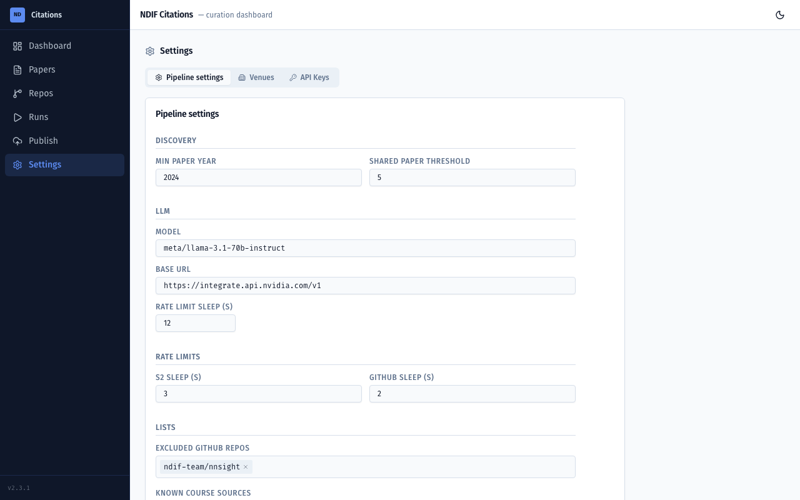

- **Discovery:** minimum paper year, shared-paper threshold.
- **LLM:** model name, base URL, rate-limit sleep.
- **Rate limits:** how long to pause between Semantic Scholar / GitHub calls.
- **Lists:** excluded repos, known course sources, course-name patterns, NDIF keywords, README match/negative patterns.
- **Contact emails:** `OPENALEX_EMAIL` / `UNPAYWALL_EMAIL` (used to be polite to those APIs).

**Settings → Venues** maps messy venue strings to clean canonical names:

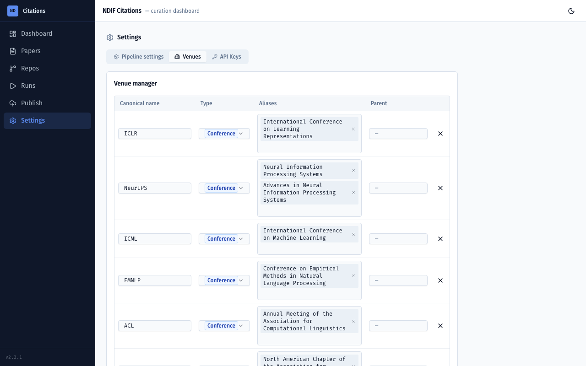

---

## 20. Publishing to the website

**Publish** is now its own tab in the sidebar (it used to live under Settings). This is where you push the approved catalog to the website's data files.

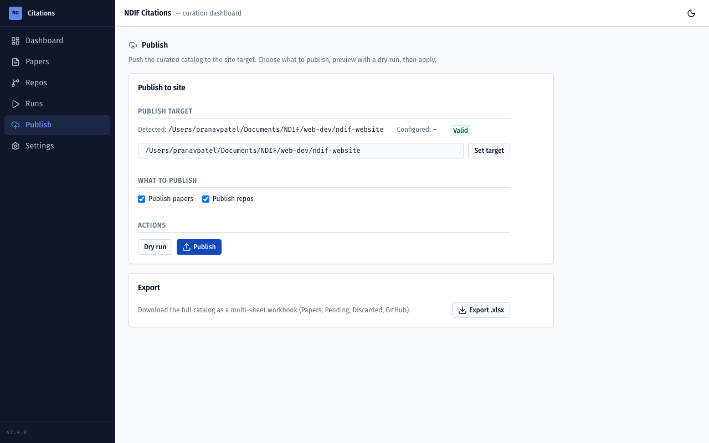

The flow:

1. **Pick the target** — the app auto-detects the sibling `ndif-website` folder and shows a **Valid** badge when it's usable. Use **Set target** to point elsewhere.
2. **Choose what to publish** — the **Publish papers** and **Publish repos** checkboxes (both on by default). Uncheck one if you only want to push the other.
3. **Always run a dry run first** — it shows exactly what *would* change (added / changed / removed papers and repos) without writing anything.
4. Only after the dry run looks right do you click **Publish**. It asks for confirmation, then writes the selected data to the site's data files.
5. The website then needs a **rebuild** to show the new data.

> Publishing overwrites the site's data files, so treat it like hitting "deploy" — dry-run, eyeball the diff, then apply.

---

## 21. Export a spreadsheet

Also on the **Publish** tab: **Export .xlsx** downloads the whole catalog as a multi-sheet Excel workbook — **Papers** (verified) · **Pending** · **Discarded** · **GitHub**. Handy for grant reporting, NSF check-ins, or sharing the catalog with someone who doesn't run the app.

---

## 22. Tips & troubleshooting

- **"I changed something and the UI looks stale."** Refresh the page. (Most state updates live, but a hard refresh never hurts.)
- **A run won't start.** Check **Settings → API Keys** — preflight blocks a run if a required key is missing or your GitHub token is rejected. Hit **Test** to see which.
- **Buttons are greyed out.** Only one job runs at a time. If a run (or a Summarize/Categorize/Backfill job) is active, edits and new runs are disabled until it finishes — that's expected.
- **A paper has a 🔒 lock.** It was hand-edited and is protected from pipeline overwrites. Locked/gold-list papers shouldn't be re-summarized.
- **A paper came back "unclassified" / landed in Pending.** Normal. Open it, read the evidence, and decide. For paywalled papers, [attach the PDF first](#16-paywalled-papers-attach-a-pdf--backfill--re-categorize).
- **Cancelling a run is safe.** Before the review gate, cancelling costs nothing and changes nothing.
- **Keys are write-only.** The app never shows a stored key. Use **Test** to confirm one works, **Clear** to remove one.
- **Nothing published to the live site yet?** Publishing only writes the site's data files — the website still needs a rebuild to show them.

---

## 23. Glossary

| Term | Meaning |
|---|---|
| **Bucket** | Where a paper sits in review: **Verified / Pending / Discarded**. Only Verified publishes. |
| **Category** | The paper's relationship to NDIF: **uses NDIF / uses NNsight / referencing / unclassified**. |
| **Confidence** | How sure the classifier was, shown in the Papers table **Conf.** column and as a badge on the detail sheet: **certain / high / medium / low / none**. *medium* and *low* are the ones worth verifying by hand. |
| **Curator-locked (🔒)** | A paper you've hand-edited/promoted/discarded. The pipeline never overwrites your fields again (it only fills blanks). |
| **The review gate** | The pause in an Incremental run where you choose Process / Skip / Discard *before* any LLM spend. |
| **Backfill evidence** | A free, no-LLM action that re-reads a paper's cached PDF and refreshes the evidence snippets. |
| **Evidence** | The text snippets around each NDIF/NNsight mention that the classifier used to decide a category. |
| **Dry run** | A preview of what Publish *would* change, without writing anything. |

---

## About the screenshots

The screens that changed in v2.1–2.3.1 were recaptured against the running app and are current:
**Papers table** (`20`, now with the Conf. column + Publish nav), the **Run Results panel** (`06`),
the **paper detail sheet** + its **actions** panel (`22`, `22b`), and the **Publish tab** (`12`).

The remaining reused shots (`01` dashboard, `02` API keys, `03` run setup, `04` live run, `05`
review gate, `10` pipeline settings, `11` venues, `21` needs-attention, `23` summarize, `24` add
paper, `30` repos) are from v2.0 but still match the current UI — those screens didn't change.
If you ever want to refresh one, run the app (`python -m ndif_citations serve`), capture at a
1440-wide viewport, and keep the existing filename.

---

*Questions or something looks broken? Ping the NDIF web-dev team.*
